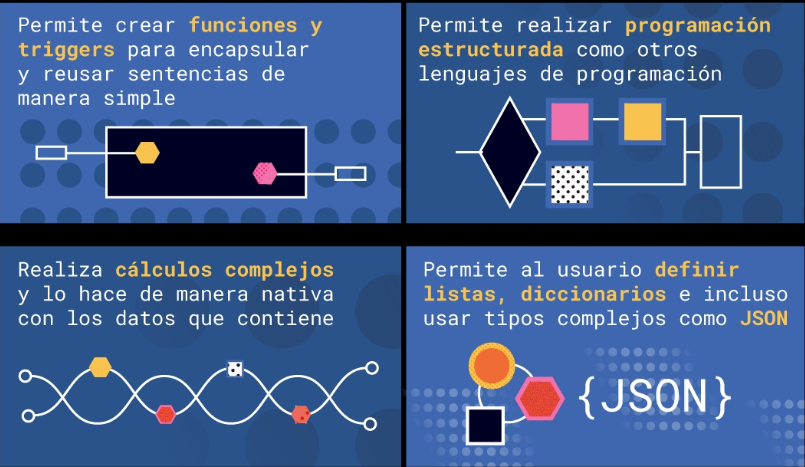

# POSTGRESQL APLICADO A CIENCIA DE DATOS

[Version en notion](https://www.notion.so/POSTGRESQL-APLICADO-A-CIENCIA-DE-DATOS-92d84df3c8a7410ab1a8c7ae389f4f12) 

- INTRODUCCIÓN
    
    Originalmente las bases de datos se utilizaban de manera texto (se guardaban datos de manera plana en archivos de texto), el problema era que se complicaba manejarlos.
    
    Bases de datos relacionales: 
    
    - Fueron un esfuerzo matemático para hacer la conjunción de datos de forma que los pudieramos extraer y usarlos más fácil.
    - Se desarrollaron de manera temprana, sin embargo han seguido evolucionando desde entonces. Algunas bases de datos desde muy temprano empezó a adoptar ciertas prácticas para poder mantenerse viva y útil dentro del ámbito de los datos.
    - Son históricamente una navaja suiza.
    - Son muy flexibles.
    - Ejemplos de este tipo de bases de datos son SQL Server, PostgreSQL, ORACLE, MariaDB.
    
    Bases de datos no relacionales: 
    
    - Se crearon estas nuevas bases de datos que fueran específicas para manejar ciertos casos de datos.
    - Nuevos jugadores en escena.
    - Han ganado terreno rápidamente.
    - No son solo un tipo, son diferentes.
    - Al contrario de la base de datos relacionales, no son una sola herramienta para todo.
    - Ejemplos: cuando tienes que extraer millones de datos por segundo.
    
    Puntos fuertes de las bases de datos relacionales (RDB): 
    
    - Multipropósito. Este tipo de bases de datos te va a resolver la mayoría de los casos de uso. Nos permite jugar con los datos internamente en el manejador de bases de datos (navaja suiza).
    - Ampliamente utilizadas: las vamos a encontrar en todas partes.
    - Información consistente: que un dato o serie de datos solo existan de manera única en la base de datos. No se nos permite repetir una y otra vez los datos en la base de datos sino que la tenemos una vez almacenada y la relacionamos con otra información de tal forma que si cambia una vez la tendremos cambiada en todas las demás relaciones y podemos mantener una gran consistencia de datos, optimizando el mantenimiento.
    - Flexible: se puede ocupar para muchas cosas.
    - Retrocompatible: Históricamente los manejadores de RDB han guardado muchas de las propiedades que tenían originalmente y han avanzado pero sin dejar de dar solución a todo lo que es estandar. Son muy consistentes en el roadmark y en la planeación de su producto.
    - Completamente programable: te permite usar lenguajes procedurales que te pueden ayudar a no solo hacer datos y guardarlos sino también hacer algo mucho más complejo con un flujo de datos.
    
    Conceptos importantes de las bases de datos relacionales:
    
    - Entidades/tablas: Cualquier objeto representable del mundo real en la bse de datos.
    - Atributos: Conforman a las entidades. Propiedades inherentes al objeto.
    - Relaciones: son la manera en la que se unen una entidad con otra entidad y decirnos qué relación existe entre ellas.
    - Triggers: o disparadores. Son otro tipo de funciones que nos ayudan a ligar los top procedures con otra cosa, por ejmplo, un evento.
    - Store procedures: son básicamente funciones o procedimientos que nos permite almacenar el manejador de bases de datos que nos permite ejecutar muchas veces de manera útil sin tener que repetir el mismo código o sentencia.
    
    Principales sentencias SQL:
    
    - SELECT: lo que queremos traer de nuestra tabla. Suelen ser las columnas.
    - AS: renombra el dato que quieres traer
    - FROM: de donde va a venir la información
    - WHERE: nos permite filtrar lai nformación que vamos a traer.
    - GROUP BY: agrupa la información po el criterio que le digamos.
    - ORDER BY: Ordena deacuerdo a un criterio que le digamos.
- CIENCIA DE DATOS
    
    Es importante que un científico de datos entienda bien del negocio porque su aportación más grande a una empresa es el impacto. El trabajo es que los datos impacten de manera positiva la organización.
    
    Aplicación de la ciencia de datos:
    
    - En una organización la parte a la que más va a ayudar la ciencia de datos es a la toma de decisiones.
    - Data-Driven: Consiste en tomar decisiones basadas en los datos. Es labor del científico de datos brindar estos datos y sus representaciones.
    - Información significativa. Entender de que manera podemos aprovechar los datos para decir que cosa y cómo la vamos a presentar.
    - Representación de los datos. Es importante presentar de forma visual los datos dependiendo del problema y el publico al que va dirigida esta presentación.
    - Neutralidad de datos. Hay ocasiones en la que los datos escogidos generan situaciones fuertes de discriminación a la hora de usarlos en modelos de AI, esto es conocido como Machine Bias.
    - Storytelling con datos. Es importante ser capaz de comunicar resultados para poder generar un impacto dentro de la organización.
    
    Equipos orientados a datos (roles o perfiles):
    
    - **DBA** (Dabta Base Administrator). Mantener y administrar el motor de base de datos
    - **Data Warehouse** (Almacén de datos). Guardar datos pensando a futuro para poder trabajarse
    - **ETL/ Data Pipelines** Llevar datos de un lado a otro. Toma la data que llega a la aplicación en forma de documento, la transforma a una forma que se puede guardar como tablas y ponerlas en un lugar que pueda ser fácilmente consultada.
    - **BI (Business Intelligence)** Precursores del DataScience, empezar a extraer datos y entender los datos y sus repercusiones, encontrar patrones
    - **Data Science** Entender a la organización e impactarla de forma positiva
    - **ML (Machine Learning)** Técnica para clasificar información o realizar predicciones con datos historicos
    
    Relación entre ML y DS:
    
    La relación entre estos dos es que **ML** Es una herramienta más que complementa al Data Science y a la organización en vez de realmente sustituirlo.
    
    **ML** es un conjunto de ciencias, estrategias, disciplinas y algoritmos que nos van ayudar a tomar la capacidad de computo de las maquinas para resolver problemas de clasificación, de forma que se haga de forma automática, otro punto es realizar predicciones con base a patrones para generar tendencias acorde al comportamiento historico para predecir el futuro.
    
    Hay 2 casos de uso muy particulares del ML: Clasificación (toma datos que tenemos guardados y encuentra ciertos grupos y segmentos con sus patrones) y predicción (toma datos históricos que tienen una fecha de vencimiento, los ordena, analiza y encuentra patrones y con esto hace una predicción hacia futuro).
    
    **Data Science** Conoce a la organización y empresa a detalle para poder hacer algo al respecto. Toma todas las variables de la organización y herramientas disponibles y las une para causar el mejor impacto
    
- POSTGRESQL
    
    Diferencias entre otros manejadores y PostgreSQL:
    
    - Código **libre** y orientado a la **comunidad**
    - Base de datos **adaptada y madura,** soporta **JSON** y funciones **estadísticas.**
    - Lenguaje **PL/pgSQL** (Procedural Language/PostgreSQL)
    - Se dedicó muy temprano al manejo de **objetos.**
    - **Particiones** en las tablas mediante estrategias
    - **Common table expressions.** Expresiones que utiliza postgresql para el tratamiento de datos como tablas virtuales, más eficiente en tiempo de ejecución
    - **Window functions** trata de encontrar relaciones entre un registro y el resto de registros
    
    
    
- STORED PROCEDURES
    
    En los lenguajes de programación es algo que se conoce como una serie de pasos que se encuentran a algo muy similar a una función pero tiene la particularidad de que no retorna ningún valor, es decir, va a ejecutar la serie de pasos que hay dentro de el procedimiento pero realmente no va a extraer ningún valor para regresar.
    
    PLPGSQL es un lenguaje ampliado derivado del estándar SQL, por lo tanto se puede hacer todas las sentencias SQL estándares y por encima de eso tiene funciones muy específicas para hacer ciertas cosas como los stored procedures y triggers.
    
    Cualquier cosa que quieras automatizar o algo que quieras hacer una y otra vez lo puedes encapsular en un procedimiento.
    
    - Funciones → Son más avanzadas. Regresan tipos de datos. Tienen más flexibilidad. No son estándar de SQL, se tiene que usar el lenguaje PLPGSQL.
    - Procedures → Integran lógica a la sentencias SQL. Se han ido incluyendo en el estándar SQL. No regresan ningún valor.
    - Los procedimientos ya hacen parte del lenguaje SQL estándar
    
    Estructura:
    
    - Con lenguaje SQL:
        
        Este lo vamos a encontrar en el listado de la izquierda, dentro de **PROCEDURES**
        
        CREATE OR REPLACE PROCEDURE + *nombre_función*() + LANGUAGE + SQL **+ AS + $$ + *accion_a_ejecutar* + ; + $$ + ;
        
        Para llamarla: CALL + nombre_funcion + ;
        
    - Con lenguaje PostgreSQL o con las funciones que no son estándar de SQL:
        
        las funciones siempre regresan un valor, por lo que después del RETURN tenemos que decirle qué va a regresar. VOID es vacío, es decir, que no tiene que regresar ningún valor y eso es lo que define a un procedimiento.
        
        Este lo vamos a encontrar en el listado de la izquierda, dentro de **FUNCTIONS**
        
        CREATE OR REPLACE FUNCTION+ *nombre_función*() + RETURNS + qué_regresa + LANGUAGE +plpgsql+ AS + $$ + BEGIN + acción_a_ejecutar + END + $$ + ;
        
        para llamarla: SELECT + nombre_función
        
- TRIGGERS
    
    La importancia de los triggers es que podemos ejecutar situaciones de agregación muy complejas en tablas cada vez que hacemos un nuevo registro, borramos uno o lo cambiamos; lo cual nos permite mantener cuestiones de estadística al día sincronizando diferentes fuentes de datos y ejecutando triggers cada que algo sucede en una.
    
    Estructura:
    
    1. Creamos la función primero:
        
        CREATE OR REPLACE FUNCTION duplicate_records() 
        RETURNS trigger
        LANGUAGE plpgsql
        AS $$
        BEGIN
        INSERT INTO tabla_replica(nombre_replica, apellido_replica)
        VALUES (NEW.nombre_master, NEW.apellido_master);
        RETURN NEW;   ##esto regresa el registro nuevo que se acaba de hacer
        END
        $$;
        
        - Los valores de la tabla master se van a insertar en la tabla réplica cada vez que se haga un INSERT, de tal manera que ambas tablas se mantengan sincronizadas.
        - Esta es una trigger function, por lo van a estar en el listado de la parte izquierda donde dice trigger functions.
    2. Luego creamos el trigger:
        
        CREATE TRIGGER duplicate_master_to_replica
        BEFORE INSERT   ##esto especifica cuando vamos a ejecutar la función (antes del registro en la tabla original se ejecuta la función del trigger).
        ON tabla_master 
        FOR EACH ROW
        EXECUTE PROCEDURE duplicate_records();
        
        - Necesitamos esto para que la función si se ejecute. Esto se llama el disparador.
    
    Tipos de disparadores:
    
    
    
- DECLARANDO VARIABLES EN LA FUNCIÓN
    
    Estructura:
    
    - el REAL define el tipo de variable
    - TRUNCATE TABLE ayuda a borrar lo que existe en la tabla si había algo antes y guarda nuevos datos.
        
        CREATE OR REPLACE FUNCTION duplicate_records() 
        RETURNS VOID
        
        LANGUAGE plpgsql
        AS $$
        
        DECLARE
        
        *nombre_variable_1* REAL := *valor_inicial_de_variable1* ;
        
        *nombre_variableN* REAL := *valor_inicial_de_variableN* ;
        
        BEGIN
        
        *función*
        
        END
        
        $$
        
    
    Ejemplo:
    
    
    
- INTEGRACIÓN CON OTROS LENGUAJES
    
    El lenguaje estándar utilizado en bases de datos relacionales es SQL (Structured Query Language), Sin embargo, carece de estructuras de control y otras abstracciones que hacen poderosos a los lenguajes procedurales de programación.
    
    PL/pgSQL: es literalmente un superset de SQL que incluye propiedades de un lenguaje estructurado que, por un lado, nos permite crear funciones complejas y triggers; y, por el otro lado, agrega estructuras de control, cursores, manejo de errores, etc.
    
    Otros lenguajes: 
    
    - C: La biblioteca que permite al lenguaje C ejecutarse en PostgreSQL es llamada libpq y es una interfaz de programación que permite extender y hacer de interfaz para permitir a otros lenguajes ejecutarse en esta base de datos.
    - PL/Tcl (Tool Command Language): su paradigma consiste en que todo en él es un comando, incluyendo la estructura del lenguaje que, sin embargo, son suficientemente flexibles para poderse sobreescribir, haciéndolo un lenguaje sumamente extensible.
    - PL/Perl: Dada la propiedad de englobar funcionalidad en forma de bloque y de la rapidez y facilidad con la que trabaja con datos tipo cadena, este lenguaje es ideal para el tratamiento de información de una base de datos relacional.
    - PL/Python: Parte de sus fortalezas son sus implementaciones de funciones map, reduce y filter en conjunto con list comprehensions, sets, diccionarios y generadores. Dadas las propiedades nativas para manejar estructuras de datos complejas, es un lenguaje ideal para manejar la salida de un query SQL. La implementación de Python para PostgreSQL te permite crear funciones complejas en un lenguaje completo y popular sin tener que utilizar PL/pgSQL.
        - Para instalar el lenguaje Python en PostgreSQL, una vez instaladas las bibliotecas apropiadas para cada Sistema Operativo, es necesario ejecutar el siguiente query:
            
            CREATE EXTENSION plpythonu
            
        
        [Chapter 46. PL/Python - Python Procedural Language](https://www.postgresql.org/docs/11/plpython.html)
        
    
    Ejemplo de lenguaje PL/pgSQL:
    
    
    
    Ejemplo de lenguaje PL/Python:
    
    
    
- TIPOS DE DATOS PERSONALIZADOS
    
    El tipo de dato lista nos ayuda a que tengamos una lista predefinida de posibilidades de las cuales elegir.
    
    Estructura del tipo de dato lista:
    
    - ENUM es una lista que podemos usar en forma de diccionario. Permite solo los valores que le definamos en el paso 1, por lo que si intentamos insertar un valor que no esté en esta nos va a salir error. ENUM nos sirve para definir una lista de posibilidades entre las cuales el usuario puede elegir.
    1. Creamos el tipo de dato:
        
        CREATE TYPE *nombre_tipo_de_dato* AS *tipo_de_dato (valor1,…,valorn) ;*
        
        
        
    2. Lo llamamos o usamos al crear una tabla:
        
        CREATE TABLE *nombre_tabla*(*valor1 nombre_tipo_de_dato,…,valorn nombre_tipo_de_dato*);
        
        
        
- AGREGACIÓN DE DATOS
    - MIN
    - MAX
    - SUM: Es una de las funciones que más se ocupan
    - COUNT: COUNT(a través de qué índice queremos que cuente)
        - este código cuenta la cantidad de películas que hay en cada categoría.
        
        
        
        Hay que tener en cuenta que count(*) cuenta todas la filas y count(campo) no toma encuenta los campos con valores nulos al realizar la cuenta.
        
    - AVG: Average, promedio.
- PENSANDO EN LA PRESENTACIÓN
    
    La presentación de los datos se realiza desde la planeación del proyecto.
    
    - **Planeación**. Siempre que se pretenda hacer un entregable (como un dashboard) es importante planear al mismo y su desarrollo. *e.g Si quiero mostrar una grafica de tendencias de las ventas debo de obtener lo datos ordenados por fechas con sus valores*.
    
    Es importante cuestionarse: ***¿qué quiero decir? ¿qué punto quiero destacar?***
    
    La forma más común en la que se consumen este tipo de datos o información generalmente es en forma de dashboards. Los dashboards son básicamente tableros que muestran cierto tipo de información. Hay distintos tipos de Dashboards para resaltar informacion ya sea del dia o del mes, o ver el total de unos datos en el tiempo, o usando graficas de pie para mostrar la relacion que existe entre los datos. Al escoger la forma de mostrarlo pensar en que historia quiero contar, pues ciertos graficos por defecto resaltan cierta informacion o relacion de los datos.
    
    **La presentación es muy importante,** ya que presentar un mismo informe de una forma u otra puede cambiar la forma en que los datos se interpretan y la historia que se cuenta, por lo cual es tan importante también conocer muy bien el negocio y los datos del mismo, para contar **historias** que ayuden a tomar buenas decisiones.
    
- TRABAJANDO CON OBJETOS
    
    Una de las funciones más interesantes que nos ofrece el manejador de bases de datos PostgreSQL es que nos permite trabajar con datos u objetos Json.
    
    Trabajar con objetos JSON nos va a permitir mucha flexibilad en cuanto a estructuras y nos va a permitir mucha inmediatez para sacar datos, sobre todo en aplicaciones.
    
    Los objetos JSON son cadenas en donde se guarda una estructura con llaves de clave valor (se guarda una clave que está asociada a un valor) y puede tener diferentes niveles de anidación; esto ocasiona que lo que se guarde en la base de datos sea una cadena y todas las ventajas que hay en una base de datos relacional se vuelven más lentas y complicadas. Para esto Postgres tiene 2 versiones de implementación de JSON:
    
    - JSON normal
    - JSON Bi o binary. Ellos guardan internamente el dato ya no como un string sino como un objeto binario en el que internamente se pueden hacer más transacciones o al menos hacerlas de una forma mucho más rápida.
    
    Para crear una columna que guarde tipo de dato JSON solo tenemos que escribir json y que sea NOT NULL después del nombre de la columna.
    
    Como agregar valores:
    
    - otro_objeto_json: esto puede ser un objeto json u otra serie de clave valor
    1. INSERT INTO *nombre_tabla*(*columnas*) VALUES (‘{
        
        ”*nombre_de_llave*”: “*string*”, “*nombre_de_llave*”:  {”*otro_objeto_json*”:”*valor1*”,”*una_clave*”:”*valor*”}
        
        }’ )
        
        
        
    2. Hasta este punto se ven como si fueran cadenas normales, pero la diferencia viene a la hora de cómo data science extraer todos los datos. Entonces extraigamos los datos:
        
        SELECT *nombre_columna_con_datos_json* → ‘*nombre_de_llave*’ AS *alias* FROM *nombre_de_tabla;*
        
        
        
        Con la flecha le estamos diciendo que lo que vamos a extraer es del json info la llave cliente y lo que traiga esa llave es lo que nos va a arrojar la variable client.
        
    3. Si queremos extraer los datos en formato string o cadena solo tenemos que poner flecha doble en vez de flecha sencilla en el paso 2. con esto nos regresa un texto, en nuestro ejemplo.
        
        
        
    - Ejemplo con WHERE:
        
        
        
- AGREGANDO OBJETOS
    
    Una de las funciones más importantes que tenemos como data scientist y la mejor que nos ofrece una base de datos relacional es hacer la sumarización de datos.
    
    Las sumarización es el proceso de sacar datos resumidos a través de grupos, por ejemplo.
    
    Cómo sumarizar objetos:
    
    1. Creamos nuestro código base.
    2. Tenemos que decirle primero que el dato no es un string ni un JSON. Tenemos que transformarlo primero a un objeto JSON en string y luego el string en un integer (entero). Para esto usamos la función llamada CAST. 
        1. CAST transforma un tipo de dato en otro
        
        
        
        En este ejemplo queremos en formato JSON el objeto items, y derivado del objeto items lo que queremos es la cantidad transformada en un string o texto. Después tenemos que decir qué tipo de datos queremos (INTEGER para poder sumarizaciones como MIN).
        
    
    Hay que tener en cuenta que esto es complicado para el motor de base de datos, ya que internamente hace muchos cálculos para poder sacar este tipo de datos, por esto, es más recomendable hacer sumarización de datos básicos y no con objetos.
    
- COMMON TABLE EXPRESSIONS
    
    Esto tiene que ver con que se utilizan las expresiones de las tablas de una manera que pueden ahorrar memoria. Se crearon algunas herramientas que nos ayudan a quitar el peso de la memoria y hacerlo de manera más rápida. También nos ayudan a hacer unos procesos iterativos que normalmente sql normal no permite.
    
    SQL normal es un lenguaje pensado para consultar datos no más, pero no nos ayuda, por ejemplo, con estructuras de control o cuestiones iterativas.
    
    Otro caso de uso para este tipo de funciones sería extraer los datos de una tabla y meterlos a otra pero iterando sobre ellos y cambiandolos. También podría ser si hay algún error o modificación y tenemos que ir uno por uno en los registros de la tabla y cambiarlos (esto normalmente se hace con un UPDATE WHERE pero también lo podríamos hacer con un método iterativo).
    
    Estructura del common table expression:
    
    1. WITH → sentencia nueva. Es parte de lo que las define y con esto sabemos que estamos haciendo un common table expression
    2. RECURSIVE → porque estamos generando una tabla recursiva. Esto le va a indicar que va a hacer un proceso iterativo
    3. nombre de la tabla recursiva (parámetro)
    4. Tenemos que definirlo. Para esto utilizamos la sentencia AS 
    5. (VALUES(1)  UNION ALL SELECT n+1 FROM nombre de la tabla recursiva …) → Vamos a decir que tiene un valor de 1 que va a estar en unión con una sentencia SELECT para que podamos sacarlo de una tabla real.
    6. Al final de esta construcción tenemos que llamarla con un SELECT normal
    
    
    
- WINDOW FUNCTIONS
    
    Las window function se ocupan para entender la relación que guarda un registro en particular con respecto al resto del dataset, ya sea una tabla, una partición o un query.
    
    Generalmente se encargan de hacer rankings. Esto funciona no solo en tablas o particiones sino también si estás haciendo un query complejo y al final tienes que decidir en qué lugar queda este registro tomando en cuenta la cantidad de todo.
    
    Lista de window function:
    
    
    
    Tipos de window function:
    
    - Aggregate Window Functions:
        - SUM(), MAX(), MIN(), AVG(). COUNT()
    - Ranking Window Functions:
        - RANK(): nos da el rango que ocupa dentro del esquema total
        - DENSE_RANK(): diferencia cuando tienes más de un valor igual
        - ROW_NUMBER(): Arroja el número de registro actual
        - NTILE()
    - Value Window Functions:
        - LAG(), LEAD(), FIRST_VALUE(), LAST_VALUE()
    
    Sintaxis:
    
    
    
- PARTICIONES
    
    Particionado: tomar una tabla y dividirla en segmentos lógicos de tal forma que para el manejador sea más fácil de manejar, consultar, guardar datos; dependiendo de la estrategia que se utilice. E internamente todos los manejadores usan esta estrategia para mejorar o segmentar un poco los datos que se guardan en ella. 
    
    - La búsqueda se acelera. Por ejemplo, si lo particionamos por tiempo.
    - No todas las tablas deben de ser particionadas, vale la pena hacerlo unicamente cuando hay muchos registros.
    - El particionado altera la consistencia de la tablas. Una de las desventajas es que no se puede hacer una clave única o ID una vez que se tiene la partición. En este caso el índice o la clave es el campo por el cual tu particionas.
    - Son muy interesantes cuando se hacen dashboards, ya que muchas veces los informes los necesitamos de manera segmentada, cada uno en su partición diferente de manera que cualquier herramienta de visualización vaya a buscar información en específico los encuentre de manera inmediata, acelerando las búsquedas o queries.
- DASHBOARDS
    
    Los dashboards son tableros que nos permiten identificar de manera puntual y de un vistazo muchas cuestiones acerca del negocio.
    
    - Se manejan dependiendo el tipo de público
    - Generalmente se miden como data points
- DATOS EN EL TIEMPO
    
    Una de las formas más útiles de contar una historia o mostrar información es con una línea de tiempo.
    
    - Se pueden encontrar picos de alguna actividad
    - Se pueden encontrar tendencias.
    - Se necesita un campo que tenga que ver con fecha.
- PROYECTO - EJEMPLOS
    - Top 10. Usamos la window function ROW_NUMBER() para asignarle el lugar a cada película con mayor cantidad de rentas
        
        
        
    - Creamos una trigger function dandole click derecho → create donde dice trigger function. Ponemos el nombre, definimos el idioma en definition y en la parte de CODE escribimos BEGIN, END y en el medio la acción que queremos que haga.
        - Los datos los va a sacar con un SELECT NEW, que es el nuevo registro que se va a insertar en la tabla. Esto lo que va a hacer es que cada vez que insertemos algo en la tabla movies se actualice en la nueva tabla que ya tiene el tipo de cambio específico.
        - El CURRENT_TIMESTAMP toma el tiempo del servidor actual y lo pone como fecha y hora de la última actualización.
        
        
        
        - Ahora que ya tenemos la función que nos regresa un trigger tenemos que crear el trigger en si. Este es un trigger que va a actualizar los tipos de cambio on update de la tabla. AFTER INSERT OR UPDATE significa que cada vez que insertemos o actualicemos un registro en la tabla movies va a hacer el cambio y guardar un nuevo valor ahora en la tabla destinada (en este caso es en la tabla )
        
        
        
    - Usamos el mismo código para sacar el top 10 pero quitandole el limit y reemplazando ROW_NUMBER por PERCENT_RANK para ver el puesto en porcentajes y el DENSE_RANK nos trae un rango más directo, sin porcentaje
        
        
        
        
        
    - Para ver el número de rentas por ciudad:
        
        
        
    - Cantidad de rentas de cada película por mes y año de renta
        
        
        
    - Cantidad de rentas hechas separados por mes y año. Podemos agregarle un ORDER BY the_year y the_month para que se vea organizado.
        
        